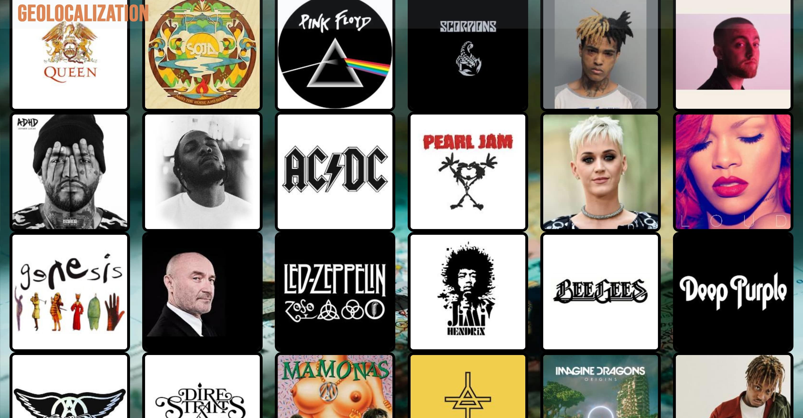

**GROUPIE-TRACKER-GEOLOCALIZATION**

> Objectives

You must follow the same principles as the first subject.

    * Groupie Tracker Geolocalization consists on mapping the different concerts locations of a certain artist/band given by the Client.

    * You must use a process of converting addresses (ex: Germany Mainz) into geographic coordinates (ex: 49,59380 8,15052) which you must use to place markers for the concerts locations of a certain artist/band on a map.

    * You are free to use the Map API you found more appropriate.

> Instructions

    * The backend must be written in Go
    * You must handle website errors
    * The code must respect the good practices
    * It is recommended to have test files for unit testing.

> Allowed packages

    * Only the standard Go packages are allowed

> Usage

    * Here is a simple example of the process of giving an address and returning a marker to the location.

This project will help you learn about :

    * Manipulation and storage of data
    * HTML
    * Manipulation of Maps API
    * Geolocation, geocoding, etc
    * Event creation and display
    * JSON files and format

> Authors : 
    * tfort (captain)
    * kcastel
    * jpintel
